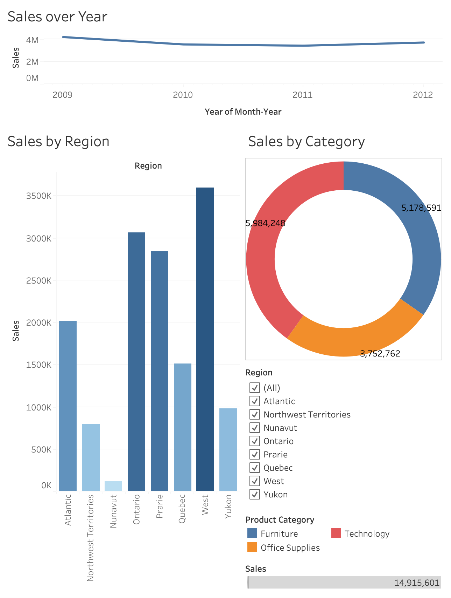

# Dashboard-Design

## 📌 Project Overview
This project analyzes **Superstore Sales data** to uncover trends and insights across **time, regions, and product categories**. Using **Tableau Desktop (Mac)**, I built an interactive dashboard with multiple visualizations and filters.

The goal is to identify **sales performance drivers** and provide actionable business insights.

---

## ⚙️ Steps Performed
1. **Imported the dataset** (`Superstore-Sales.csv`) into Tableau.  
2. **Converted `Order Date`** into *Month-Year* format for time-based analysis.  
3. **Created visualizations**:
   - **Line Chart** → Sales over Years  
   - **Bar Chart** → Sales by Region  
   - **Donut Chart** → Sales by Product Category  
4. **Added a Filter/Slicer** for Region (to allow interactive exploration).  
5. **Applied color encoding** to highlight top-performing categories and regions.  
6. **Combined visuals into a Dashboard** with a clean layout.  

---

## 📊 Dashboard Preview

---

## 🔍 Insights
1. **Sales Over Time**: Sales stayed mostly stable (2009–2012), with a dip in 2010 and recovery afterward.  
2. **Regional Performance**: The **West region** dominates sales (~3.6M), while smaller regions like **Nunavut** and **Northwest Territories** contribute the least.  
3. **Category Performance**: **Technology** is the top-selling category (~6M), followed by **Furniture (~5.1M)** and **Office Supplies (~3.7M)**.  
4. **Overall**: Growth is primarily driven by **Technology sales in the West**. Seasonal promotions could maximize Q4 peaks.  

---

## 📂 Deliverables
- **Dashboard (PDF)** – Exported Tableau dashboard.  
- **Insights File (TXT/Slides)** – Written insights for reporting.  
- **README (This File)** – Documentation for project overview.  

---

## 🚀 Tools Used
- **Tableau Desktop **  
- **Dataset**: Superstore Sales (CSV)  

